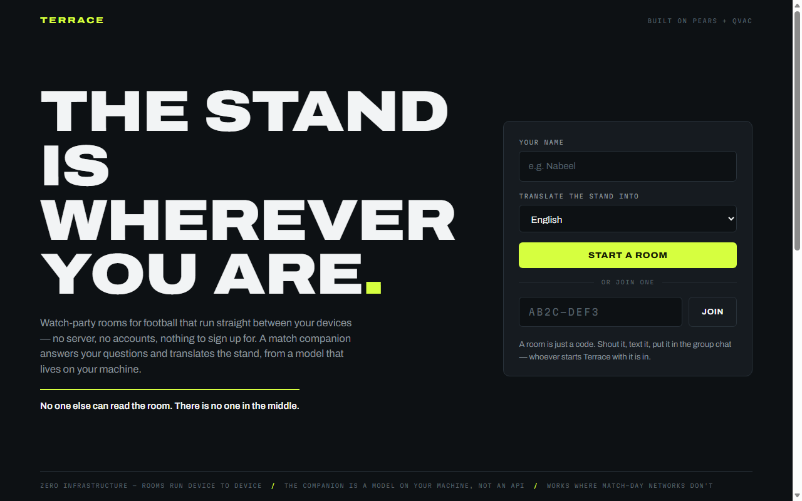
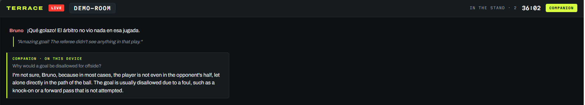

<p align="center">
  
</p>

<h1 align="center">Terrace</h1>

<p align="center">
  <strong>Peer-to-peer watch parties for football, with an on-device AI match companion.</strong><br>
  No servers. No accounts. No API keys.
</p>

<p align="center">
  <a href="LICENSE"></a>
  = 22.17">
  
  
</p>

<p align="center">
  Built for the <a href="https://dorahacks.io/hackathon/tether-developers-cup">Tether Developers Cup</a>
  on two Tether stacks at once: rooms run on <strong>Pears</strong> (Hyperswarm)
  and the companion runs on <strong>QVAC</strong> — a language model living entirely on your device.
</p>



## What it does

- **Open a room, shout the code.** A room is just a code like `AB2C-DEF3`. Anyone
  who starts Terrace with that code lands in the same stand — peers connect
  directly to each other over the Hyperswarm DHT. There is no server to pay for,
  moderate you, or go down at full time.
- **Chat with the stand.** Live fan chat, peer to peer.
- **Tap TRANSLATE on any message.** A Brazilian and a Japanese fan can banter —
  the translation happens on your own machine. Nobody's messages leave the room.
- **Ask the companion.** "Why was that disallowed?" — the on-device model answers
  in plain speech, using the room's recent chat as context. Works even where
  cloud AI can't: stadium dead zones, throttled match-day networks, or countries
  where those services aren't available.



*A live room — Bruno's Spanish message translated on Alice's machine, and the
companion answering a rules question. Every word of AI output was generated on
the laptop that asked for it.*

## Quick start

Requires **Node.js ≥ 22.17**.

```bash
git clone https://github.com/Uthmannabeel/terrace.git
cd terrace
npm install
npm start                              # opens a new room, prints its code
```

Then open the printed URL (default `http://127.0.0.1:3600`), pick a name, and
start a room. The AI model (~740 MB) downloads to `~/.qvac` on first run and is
reused after that.

To join an existing room from the command line:

```bash
npm start -- --room AB2C-DEF3 --name Marta --lang English
```

| Flag | Meaning |
|---|---|
| `--room CODE` | join a room directly (skips the landing page) |
| `--name NAME` | your display name |
| `--lang LANGUAGE` | the language TRANSLATE targets |
| `--port N` | UI port (default 3600) |
| `--no-ai` | skip the model — chat only, starts instantly |

### Two-seat demo on one machine

```powershell
npm run dht                                              # terminal 1 (local DHT)
$env:SWARM_BOOTSTRAP="1"; npm start -- --room DEMO-ROOM --name Alice --port 3600            # terminal 2
$env:SWARM_BOOTSTRAP="1"; npm start -- --room DEMO-ROOM --name Bruno --port 3601 --no-ai    # terminal 3
```

The `SWARM_BOOTSTRAP` variable points peers at the local DHT from terminal 1 —
used for development and for networks that block the public DHT. On normal
networks, skip terminal 1 and the variable entirely: two machines with the same
room code simply find each other.

## Verify it works

| Command | What it proves |
|---|---|
| `npm test` | 47 tests: protocol, rooms (real sockets), companion, feed |
| `npm run smoke` | headless end-to-end: page → P2P → page, two live instances |
| `npm run verify:ai` | the real QVAC model translating and explaining |

## How it's built

```
src/protocol/    versioned wire format — every peer frame validated, capped, allowlisted
src/room/        room codes → Hyperswarm topics; RoomSession (join/broadcast/events)
src/companion/   QVAC model, loaded once; single-lane bounded queue; prompt builders
src/app/         entry point + feed state
src/ui/          local page (served on 127.0.0.1) + WebSocket bridge
```

Full picture — diagram, data flows, trust boundaries — in
[docs/ARCHITECTURE.md](docs/ARCHITECTURE.md).

Design principles:

- **Peers are hostile input.** Every incoming frame is size-capped,
  schema-checked, and rebuilt field-by-field before it touches the app.
  Malformed traffic is dropped without ceremony.
- **Chat never waits for the AI.** Generation on modest hardware is slow, so the
  companion works through a small bounded queue; translations arrive when ready,
  and a stalled generation times out instead of wedging the lane.
- **Fully offline-capable.** Self-hosted fonts, no CDNs, no telemetry. With a
  local DHT bootstrap, an entire room can run on a LAN with zero internet.

## Documentation

| Doc | Contents |
|---|---|
| [ARCHITECTURE.md](docs/ARCHITECTURE.md) | system diagram, modules, data flows, trust boundaries |
| [DEMO_SCRIPT.md](docs/DEMO_SCRIPT.md) | the 3-minute demo, shot by shot |
| [PREFLIGHT.md](docs/PREFLIGHT.md) | live test checklist — expected result for every step |

## License

[MIT](LICENSE) — do what you like with it; the room belongs to the fans in it.
